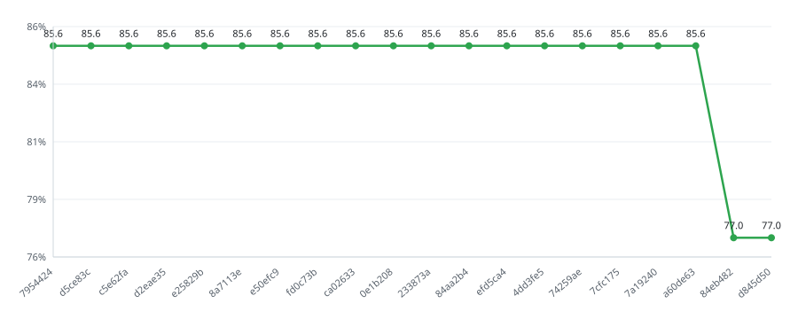

# codecov_ros2_demo

A minimal ROS 2 (Jazzy) C++ workspace used to demonstrate how [Codecov](https://about.codecov.io/)
reports test coverage on every commit and pull request.

[](https://github.com/wansiedler/codecov_ros2_demo/actions/workflows/ci.yml)
[](https://github.com/wansiedler/codecov_ros2_demo/actions/workflows/lint.yml)
[](https://github.com/wansiedler/codecov_ros2_demo/actions/workflows/security.yml)
[](https://github.com/wansiedler/codecov_ros2_demo/actions/workflows/runtime-analysis.yml)
[](https://github.com/wansiedler/codecov_ros2_demo/actions/workflows/conventions.yml)
[](https://github.com/wansiedler/codecov_ros2_demo/actions/workflows/release.yml)
[](https://github.com/wansiedler/codecov_ros2_demo/actions/workflows/sonarcloud.yml)

[](https://codecov.io/gh/wansiedler/codecov_ros2_demo)
[](https://sonarcloud.io/summary/new_code?id=wansiedler_codecov_ros2_demo)
[](https://sonarcloud.io/summary/new_code?id=wansiedler_codecov_ros2_demo)
[](https://sonarcloud.io/summary/new_code?id=wansiedler_codecov_ros2_demo)
[](https://sonarcloud.io/summary/new_code?id=wansiedler_codecov_ros2_demo)
[](https://sonarcloud.io/summary/new_code?id=wansiedler_codecov_ros2_demo)
[](https://sonarcloud.io/summary/new_code?id=wansiedler_codecov_ros2_demo)
[](https://sonarcloud.io/summary/new_code?id=wansiedler_codecov_ros2_demo)
[](https://sonarcloud.io/summary/new_code?id=wansiedler_codecov_ros2_demo)

[](https://scorecard.dev/viewer/?uri=github.com/wansiedler/codecov_ros2_demo)
[](https://github.com/wansiedler/codecov_ros2_demo/security/code-scanning?query=is%3Aopen+tool%3ACodeQL)
[](https://github.com/wansiedler/codecov_ros2_demo/security/code-scanning?query=is%3Aopen+tool%3ASemgrep)
[](https://github.com/wansiedler/codecov_ros2_demo/security/code-scanning?query=is%3Aopen+tool%3ATrivy)
[](https://github.com/wansiedler/codecov_ros2_demo/network/dependencies)

[](https://docs.ros.org/en/jazzy/)
[](https://en.cppreference.com/w/cpp/23)
[](https://pre-commit.com/)
[](https://www.conventionalcommits.org/)
[](https://github.com/wansiedler/codecov_ros2_demo/actions/workflows/runtime-analysis.yml)
[](https://github.com/wansiedler/codecov_ros2_demo/actions/workflows/runtime-analysis.yml)
[](https://github.com/wansiedler/codecov_ros2_demo/blob/main/LICENSE)

## Coverage at a glance

The graphs below are served live by Codecov and update with every upload.
Size encodes the number of statements, colour encodes coverage.

| Sunburst | Grid | Icicle |
| --- | --- | --- |
| [](https://codecov.io/gh/wansiedler/codecov_ros2_demo) | [](https://codecov.io/gh/wansiedler/codecov_ros2_demo) | [](https://codecov.io/gh/wansiedler/codecov_ros2_demo) |

* **Sunburst** — innermost ring is the whole project, outward rings are folders
  and finally single files.
* **Grid** — one block per file.
* **Icicle** — same hierarchy as the sunburst, laid out top to bottom.

## Coverage trend



Codecov's own trend chart reads an aggregated timeseries that is backfilled a
while after a repository is activated, so it stays empty on a fresh project even
though every commit already has a report. This SVG is rendered from the
per-commit data the API returns immediately:

```bash
scripts/coverage_trend.py --limit 20      # writes docs/coverage-trend.svg
```

The dip to 43 % is the commit that added `battery_monitor.cpp` without tests,
and the step from 97 % to 83 % is branch coverage being switched on - partially
covered branches start counting against the total.

## What is in here

```text
src/nav_utils/
├── include/nav_utils/velocity_limiter.hpp   # clamping + acceleration ramp
├── include/nav_utils/battery_monitor.hpp    # battery state classification
├── include/nav_utils/safety_zone.hpp        # obstacle distance -> speed scale
├── include/nav_utils/pure_pursuit.hpp       # path following geometry
├── src/velocity_limiter.cpp
├── src/battery_monitor.cpp
├── src/safety_zone.cpp
├── src/pure_pursuit.cpp
├── src/velocity_limiter_node.cpp            # rclcpp node (excluded from coverage)
└── test/                                    # ament_cmake_gtest unit tests
```

The package is deliberately small: pure C++ classes with unit tests, plus one
ROS node that wires them to topics. That is enough to produce a realistic coverage
report without needing a robot.

It builds as **C++23**, which is as far as GCC 13.3 in the `ros:jazzy` image
goes, targeting `-march=haswell`: the fleet runs on Haswell or newer, so AVX2
and FMA are available. Override with `-DARCH_BASELINE=x86-64-v2` for older
hardware; the flag is skipped entirely off x86.

`std::numbers`, the ranges algorithms and `std::expected` are available
there; `std::print`, `std::ranges::to` and `mdspan` are not - those need GCC 14.
ROS 2 Jazzy itself targets C++17, so the standard is set for this package only
and the rclcpp headers are consumed as they are.

## How coverage is produced

1. CI builds the workspace with `-DCOVERAGE=ON`, which adds `--coverage` to the
   compiler and linker flags, so GCC emits `.gcno` / `.gcda` profiling files.
2. `colcon test` runs the gtest suites, which fills the `.gcda` counters.
3. `lcov` collects the counters into `coverage.info` and strips system headers,
   gtest internals and the test sources themselves.
4. `codecov/codecov-action@v5` uploads `coverage.info` to Codecov.

`codecov.yml` then enforces two checks on every pull request:

| Check | Meaning |
| --- | --- |
| `project` | Total coverage must not drop more than 1 % below the base commit. |
| `patch` | At least 80 % of the lines *changed in the PR* must be covered. |

## Quality gates

Everything below runs on every pull request; the slow jobs also run on a schedule.

| Layer | Tooling | Where |
| --- | --- | --- |
| Formatting | `clang-format` pinned to one version for local and CI | pre-commit + `Lint` |
| Style linting | `cpplint`, `ament_cpplint`, `cmake-lint`, `ament_lint_cmake`, `yamllint`, `actionlint`, `markdownlint`, `shellcheck`, `codespell` | pre-commit + `Lint` |
| Static analysis | `cppcheck` / `ament_cppcheck`, `clang-tidy` (`.clang-tidy`, warnings are errors) | pre-commit + `Lint` |
| Licence headers | `ament_copyright` | `Lint` |
| Manifests & schemas | `ament_xmllint`, `check-jsonschema` for workflows and Dependabot | pre-commit + `Lint` |
| Commit hygiene | `commitizen` (Conventional Commits, `commit-msg` hook + CI), semantic PR title | pre-commit + `Conventions` |
| Secrets | `gitleaks` (working tree locally, full history in CI) | pre-commit + `Security` |
| Code scanning | CodeQL `security-and-quality`, Trivy, Semgrep, OSV-Scanner, OpenSSF Scorecard | `Security` |
| Supply chain | SPDX SBOM via Syft + GitHub dependency snapshot, Dependabot | `Security` |
| Toolchains | Every push builds with GCC **and** clang, warnings as errors | `CI` |
| Hardening | `-fstack-protector-strong`, `-fstack-clash-protection`, `-fcf-protection`, `_GLIBCXX_ASSERTIONS`, `_FORTIFY_SOURCE=3`, RELRO and a non-executable stack, each probed before use | build |
| Integration | `launch_testing` drives the node over real topics | `CI` |
| Runtime analysis | ASan + UBSan, TSan, Valgrind memcheck (XML artifacts) | `Runtime analysis` |
| Profiling | Callgrind + `gprof2dot` SVG call graphs, nightly | `Runtime analysis` |
| Coverage | gcov → lcov (line **and branch**) → Codecov, HTML artifact, GitHub Pages | `CI` |
| Test results | JUnit XML artifact + Codecov test analytics (flaky test detection) | `CI` |
| Quality gate | SonarCloud (bugs, smells, security hotspots, technical debt) plus imported Valgrind Memcheck findings | `SonarCloud` |
| Releases | release-please: changelog and tags from the Conventional Commits | `Release` |

CodeQL, Trivy, Semgrep, OSV-Scanner and Scorecard publish SARIF, so their
findings land in the repository's **Security → Code scanning** tab instead of
only in a log. The browsable coverage report is published to GitHub Pages from
`main`, and CI also uploads it as the `coverage-html` artifact on every run.

Two jobs need a secret before they do anything: `CODECOV_TOKEN` for the upload
and `SONAR_TOKEN` for SonarCloud. The SonarCloud job skips itself with an
explanatory summary when the token is absent, so the rest of the pipeline stays
green.

### Where to look at the results

Every tool writes to its own place. This is what each of them answers.

| Dashboard | Link | What it tells you |
| --- | --- | --- |
| Codecov overview | [app.codecov.io](https://app.codecov.io/gh/wansiedler/codecov_ros2_demo) | Current coverage, sunburst and the file tree - which file is red |
| Codecov commits | [/commits](https://app.codecov.io/gh/wansiedler/codecov_ros2_demo/commits) | Coverage per commit; the drop when untested code lands and the recovery |
| Codecov pulls | [/pulls](https://app.codecov.io/gh/wansiedler/codecov_ros2_demo/pulls) | Per-pull-request comparison against the base, and the uncovered lines of the diff |
| Codecov test analytics | [/tests/main](https://app.codecov.io/gh/wansiedler/codecov_ros2_demo/tests/main) | Flaky tests, failure history and test runtimes, fed by the JUnit XML |
| SonarCloud | [sonarcloud.io](https://sonarcloud.io/dashboard?id=wansiedler_codecov_ros2_demo) | Bugs, code smells, security hotspots, duplication and the technical debt in hours |
| GitHub code scanning | [/security/code-scanning](https://github.com/wansiedler/codecov_ros2_demo/security/code-scanning) | CodeQL, Semgrep, Trivy, OSV-Scanner and Scorecard findings, deduplicated per tool |
| Dependency graph | [/network/dependencies](https://github.com/wansiedler/codecov_ros2_demo/network/dependencies) | The SPDX SBOM produced by Syft, and Dependabot alerts against it |
| Actions | [/actions](https://github.com/wansiedler/codecov_ros2_demo/actions) | Every workflow run, its logs and its artifacts |
| Coverage on Pages | [wansiedler.com/codecov_ros2_demo](http://wansiedler.com/codecov_ros2_demo/) | The browsable lcov report for `main`, line by line |

Rule of thumb: **Codecov** answers *"is the thing I just changed tested?"*,
**SonarCloud** answers *"how bad is the code and what does fixing it cost?"*,
and the **Security tab** answers *"what is dangerous about it?"*.

### What the CI artifacts contain

Open a run under **Actions**, scroll to *Artifacts* at the bottom of the summary.

| Artifact | Produced by | What is inside |
| --- | --- | --- |
| `coverage-html` | `CI` | `genhtml` report: every source file with covered, partially covered and missed lines highlighted, including branch coverage |
| `test-results` | `CI` | gtest JUnit XML - the same data Codecov test analytics ingests, useful for a local diff of which case failed |
| `valgrind-memcheck` | `Runtime analysis` | One memcheck XML per test binary: leaks, invalid reads and uninitialised values with a full stack. The job log prints a summary of the same data, because `--xml=yes` silences valgrind's own text output |
| `callgrind-profiles` | `Runtime analysis`, nightly only | Callgrind output plus a rendered SVG call graph - where the time goes, per function |
| `nav_utils.spdx.json` | `Security` | SPDX SBOM of the workspace, ready for a Dependency-Track style tool |

`coverage-html` is the one worth opening first: unzip it and open `index.html`.
It shows exactly which branch of which `if` no test ever took, which is the part
a percentage on its own never tells you.

### Local setup

```bash
pipx install pre-commit      # or: pip install --user pre-commit
pre-commit install           # run the hooks on every commit
pre-commit run --all-files   # run them over the whole tree once
```

Sanitizer and memcheck builds are plain CMake options, so the same checks run
locally:

```bash
colcon build --cmake-args -DCMAKE_BUILD_TYPE=Debug -DSANITIZE=address,undefined
colcon test
valgrind --leak-check=full build/nav_utils/test_velocity_limiter
```

## Setup (one time)

1. Push this repository to GitHub.
2. Sign in to <https://codecov.io> with the GitHub account and enable the repository.
3. Copy the upload token from Codecov and store it in the repository as the
   secret `CODECOV_TOKEN` (Settings → Secrets and variables → Actions).
4. Push a commit or open a pull request — the CI workflow uploads the report and
   Codecov comments on the PR.

## Running the tests locally

Requires ROS 2 Jazzy and `lcov`:

```bash
source /opt/ros/jazzy/setup.bash
colcon build --cmake-args -DCMAKE_BUILD_TYPE=Debug -DCOVERAGE=ON
colcon test
colcon test-result --verbose
lcov --capture --directory build --output-file coverage.info \
  --ignore-errors mismatch,gcov,unused,empty,negative
lcov --extract coverage.info "$PWD/src/*" --output-file coverage.info
genhtml coverage.info --output-directory coverage_html   # open coverage_html/index.html
```

Running the node:

```bash
source install/setup.bash
ros2 run nav_utils velocity_limiter_node --ros-args -p max_linear:=0.8
```
